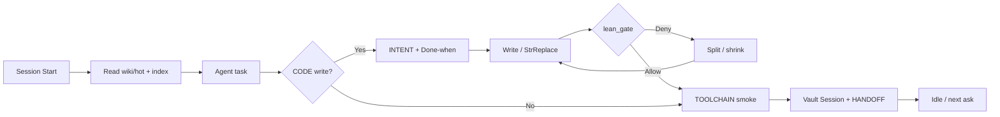

<div align="center">

  <a href="https://cursor.com">
    
    
  </a>

  <h1>kleosr</h1>

  <p><strong>Cursor harness pack — User Rules, companions, skills, Bash hooks, Obsidian memory.</strong></p>
  <p>Master Mind V17 · Bash governance · Obsidian MCP</p>

  <p>
    
    
    
    
    
  </p>

</div>

---

Requires **Obsidian** (app running) plus an Obsidian MCP server in Cursor (`user-obsidian`). Without that, durable memory does not work.

Platform: **Linux or WSL**. Native Windows is experimental. PowerShell port welcome.

How it fits Cursor: Cursor is where you build. Chats are focused and finite by design. This pack pairs that with Obsidian so decisions and sessions persist across chats. Hooks nudge a vault read at start and a write-back when you finish.

## Setup

```bash
git clone https://github.com/kleosr/kleosrules.git
cd kleosrules
chmod +x hooks/*.sh
FORCE=1 bash hooks/fleet_sync.sh all
```

Paste `user-rules/USER-RULES.paste.txt` into Cursor → Settings → Rules → User Rules, start a **new** agent chat, and confirm Hooks loaded the Bash scripts. Needs `bash` and `jq` on PATH. No Cargo. No Rust. No pack Python.

Optional naming contract per app:

```bash
mkdir -p .cursor/rules
cp skills/vernacular/TEMPLATE.md .cursor/rules/vernacular.mdc
```

## Usage

```bash
# Install / refresh ~/.cursor hooks, rules, skills + fleet projects
FORCE=1 bash hooks/fleet_sync.sh all

# Sync only / verify only
FORCE=1 bash hooks/fleet_sync.sh sync
FORCE=1 bash hooks/fleet_sync.sh verify

# House smoke (TOOLCHAIN)
bash -n hooks/session_start.sh hooks/before_submit_prompt.sh hooks/stop_gate.sh hooks/lean_gate.sh hooks/fleet_sync.sh
echo '{"prompt":"test code"}' | bash hooks/before_submit_prompt.sh
```

Loop: **paste rules → fleet_sync install → work under hooks → TOOLCHAIN green → write-back vault/HANDOFF**. Soft skills guide taste when invoked. Lean size roof (`lean_gate.sh`, 700 LOC) denies oversized writes — rewrite or stop; do not fight a deny.

Skill routes: lean → `/ponytail`; dialect → `/vernacular`; vault → `/obsidian-memory`; AST → `/codebase-memory`.

## Files

| File | Purpose |
|------|---------|
| `assets/cursor*.svg` | Official Cursor favicon (light/dark) from cursor.com |
| `user-rules/USER-RULES.paste.txt` | Master Mind V17 paste (Settings User Rules) |
| `project-rules/*.mdc` | Always-on companions synced into `.cursor/rules` |
| `hooks/*.sh` | Bash event hooks + `fleet_sync.sh` + `lean_gate.sh` |
| `hooks/policy/*.json` | Policy messages / ask-deny patterns |
| `hooks/hooks.json` | Pack hook registry |
| `hooks/hooks.project.json` | Per-repo `.cursor/hooks.json` template |
| `skills/` | On-demand Cursor skills (`config/skills.txt`) |
| `config/scan.roots` | Fleet roots for sync / verify |
| `docs/TOOLCHAIN.md` | Done recipe |
| `docs/ARCHITECTURE.md` | 5 Layers |
| `docs/CURATOR.md` | INTENT / Session / hot |
| `AGENTS.md` | Pack map |
| `HANDOFF.md` | Strict transfer; `session_start` injects tail |

## Workflow

```
paste User Rules → fleet_sync all → work under hooks
                     ↓
    vault hot → INTENT/Done-when → edit → lean_gate → TOOLCHAIN → write-back
```



## The loop (injection vs declaration)

1. **Prompt** — you send a message.
2. **Inject (Layer 2)** — `before_submit_prompt.sh` adds duties with `additional_context`. It does not mutate the user prompt.
3. **Declare (Layer 1)** — the agent writes `INTENT:` and `Done-when:` in chat before tools run.
4. **Audit (Layer 3/4)** — `stop_gate.sh` checks Done-when. If unmet, another pass. If met, clears `/state` and asks for Obsidian write-back.

## Architecture

```
.
├── assets/              — Cursor brand SVGs (official favicon)
├── user-rules/          — paste + Option C mirror
├── project-rules/       — always-on companions (SSOT)
├── hooks/
│   ├── session_start.sh / before_submit_prompt.sh / stop_gate.sh
│   ├── lean_gate.sh     — 700 LOC size roof
│   ├── fleet_sync.sh    — install + fleet sync + verify
│   ├── policy/          — JSON messages
│   ├── hooks.json       — pack registry
│   └── hooks.project.json
├── skills/              — personal / pack skills
├── config/              — skills list + scan roots
├── state/               — ephemeral intent (gitignored)
├── docs/                — ARCHITECTURE / TOOLCHAIN / CURATOR
├── AGENTS.md            — map
├── HANDOFF.md           — transfer
└── LICENSE              — MIT
```

Single pack topology — not an app monorepo. Live `.cursor/` copies are sync destinations; edit this pack and re-run `FORCE=1 bash hooks/fleet_sync.sh all`.

## License

MIT.
