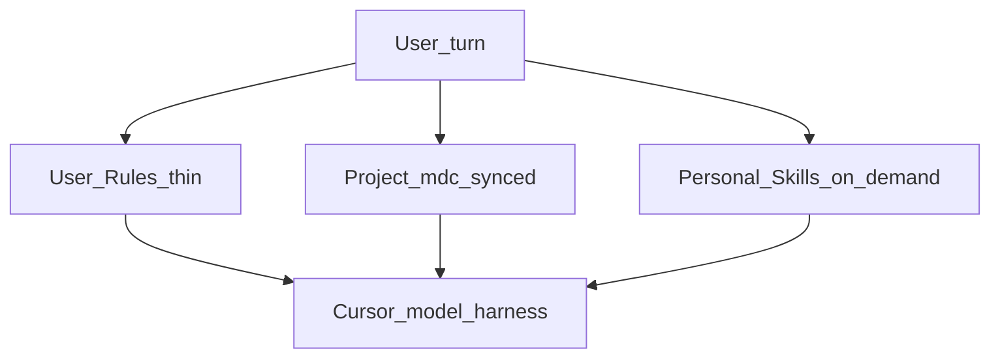

# Documentos/rules — SSOT harness (less is more)

## Layer map (no duplication)

| Layer | Owns | Does not own |
|-------|------|--------------|
| **User Rules** | Identity, precedence, pointer, communication floor | SAFETY prose, craft, git/PR/frontend protocols, life advice |
| **Project `.cursor/rules/*.mdc`** | SAFETY + SCOPE + craft (synced) | Repo map, CLI dumps, style guides |
| **Owned Skills** (`skills/` → `~/.cursor/skills/`) | On-demand ops, mapping, workspace/domain architecture, Grok prompting | Always-on law; third-party Skills |
| **prompts/** | Copy-paste menu (`cheatsheet.md`) | Ordered multi-step ritual every session |
| **AGENTS.md** | Map of *this* repo | Laws also in `.mdc` |
| **TOOLCHAIN.md / lint / CI** | Done = green, format, language bans | Soft preferences |
| **DEBT.md** | Deferred work (per repo) | Chat-only debt lists |
| **Hooks** | Enforce / inject (block, scan) | Narrate policy already in `.mdc` |

Cursor precedence: **Team → Project → User** (earlier wins).
Skills load when relevant or attached — they are not always-on context.
`AGENTS.md` is a map, not a second constitution.



## Active set (synced to every discovered project)

| File | Role | Apply |
|------|------|-------|
| `agent.mdc` | Safety + scope + craft + reporting | always |
| `types.mdc` | Type intent (bans → TOOLCHAIN) | globs |
| `testing.mdc` | What/how to test | globs |
| `debugging.mdc` | Bug protocol | agent-decidable |

Total ~130 lines. Everything else is lint, CI, TOOLCHAIN.md, AGENTS.md,
DEBT.md, or a Skill.

## Discovery (no static fleet)

Projects are **discovered**, not listed by hand:

| File | Role |
|------|------|
| `scan.roots` | Parent dirs to scan (default: Documentos) |
| `scan.ignore` | Basenames/substrings to skip |
| `lib/discover-repos.sh` | Immediate children that look like projects |
| `scan-and-sync.sh` | Discover → sync → verify (idempotent) |

A child counts as a project if it has any of: `.git`, `package.json`,
`pnpm-workspace.yaml`, `Cargo.toml`, `go.mod`, `pyproject.toml`, `AGENTS.md`,
or `.cursor/rules/`.

The harness itself (`Documentos/rules`) uses **symlinks** under `.cursor/rules/`.
Other projects get **real copies**. Skills are global symlinks only.

`repos.txt` is deprecated (comment-only). Do not maintain a fleet name list.

## Owned personal Skills (global, not copied into repos)

| Skill | Path | When |
|-------|------|------|
| git-commit | `skills/git-commit/` | User asks to commit |
| create-pr | `skills/create-pr/` | User asks to open a PR |
| frontend-design | `skills/frontend-design/` | UI / landing / visual work |
| agents-map | `skills/agents-map/` | Map/init/refresh AGENTS.md + TOOLCHAIN |
| workspace-scope | `skills/workspace-scope/` | Scope work across any repository topology |
| domain-architecture | `skills/domain-architecture/` | DDD for business-rule-heavy systems |
| design-tokens | `skills/design-tokens/` | Design tokens and UI data from source to rendered use |
| ui-structure | `skills/ui-structure/` | Layout, rhythm, separators, wrappers, minimal order |
| no-hardcode | `skills/no-hardcode/` | No hardcoded literals across FE/BE/config/infra |
| lean-code | `skills/lean-code/` | Minimal LOC, no over-engineering, no narrative comments |
| bug-hunt | `skills/bug-hunt/` | Evidence-led investigation of difficult bugs |
| system-wiring | `skills/system-wiring/` | End-to-end contracts and communication |
| codebase-memory | `skills/codebase-memory/` | Knowledge-graph navigate/trace via MCP |
| formulary | `skills/formulary/` | Opt-in Grok 4.5 prompt/harness discipline |
| humanizer | `skills/humanizer/` | Rewrite text to plain human tone; strip AI tells |
| grill-me | `skills/grill-me/` | Relentless design interview before implementation |
| session-handoff | `skills/session-handoff/` | Multi-session HANDOFF.md resume/pause |
| ship-loop | `skills/ship-loop/` | Feature conductor: chunk → TOOLCHAIN → handoff |
| eval-pass | `skills/eval-pass/` | Skeptical post-implement grader (keep-rate) |
| harness-retro | `skills/harness-retro/` | Repeated agent fail → harness fix |

`skills.txt` is the managed list. Sync creates global runtime symlinks;
unrelated personal/domain Skills remain owned by their providers.

## Execution harness (post Spec Kit)

Own the body, not the model fad:

| Piece | Role |
|-------|------|
| `agent.mdc` SESSION | One model per chat; read HANDOFF |
| `ship-loop` | Feature loop without sticky epics |
| `session-handoff` | Fresh-context continuity |
| `eval-pass` | Generator ≠ evaluator |
| `harness-retro` | Mistake → harness fix |
| `hooks/` + `install-user-hooks.sh` | Enforce no force-push / --no-verify |

Install SAFETY hooks once: `bash hooks/install-user-hooks.sh`

## Prompt menu

`prompts/cheatsheet.md` — pick **one** block per situation (task,
workspace-scope, map, assessment, rules SSOT, ship). Not a mandatory sequence.
See `prompts/README.md`. Preserve existing topology unless architecture itself
is the requested task.

## Per repo (not in this folder)

- `TOOLCHAIN.md` — real verify commands (Done) + language bans
- `AGENTS.md` — map of the repo, not law (no SAFETY/QUALITY copy-paste)
- `DEBT.md` — deferred work; not chat-only
- Lint/formatter — casing, format, dead code
- Project hooks — empty shell or repo-specific
- Security arsenal — `security-baseline/scan-all.sh` when that tree exists

### TOOLCHAIN / Semgrep candidates (not always-on rules)

Enforce in CI when present; do not restate as always-on craft:

- TS: `any`, blind `as`, non-null `!`, bare `@ts-ignore`
- Rust: `.unwrap()` outside tests/infallible (Clippy)
- Python: `Any`, silent `# type: ignore`
- Go: ignored errors
- Force-unwraps outside proven-safe paths
- Empty `catch` / swallowed errors
- Non-parameterized SQL / string-concat queries

## Sync / scan

```bash
# Full loop (preferred): discover + copy rules + skills + verify
bash /home/kleosr/Documentos/rules/scan-and-sync.sh

# Or stepwise
bash /home/kleosr/Documentos/rules/sync-to-repos.sh
bash /home/kleosr/Documentos/rules/verify-sync.sh

# List what would be targeted
bash /home/kleosr/Documentos/rules/lib/discover-repos.sh
```

Edit only the root `*.mdc` here. Never hand-edit copies under a
downstream repo’s `.cursor/rules/`. Never replace the SSOT symlinks
with divergent files.

Periodic: run `scan-and-sync.sh` when you clone a new project under a scan root,
or on a schedule (see cron note in TOOLCHAIN.md).

## User Rules

1. Open `USER-RULES.paste.txt` (or `USER-RULES.md` everything **below** `---`).
2. Cursor → Settings → Rules → User Rules → replace entire box → save.

Verify best-effort: `python3 lib/check-user-rules.py` (exit 0 = found in local
Cursor DB; exit 1 = not found or cloud-only — still paste if unsure).

If User Rules and `agent.mdc` ever disagree on SAFETY, project wins
and User Rules should be thinned further (bug), not thickened.

## Legacy dump

`/home/kleosr/Descargas/Reglas` is a historical dense draft. **Not runtime.**
Do not copy those `.mdc` into projects. See that folder’s `LEGACY.md`.

## What never goes in always-on rules

- Relationship / life / housing / cars / lifestyle coaching
- Full style guides (use Biome/Semgrep)
- Self-prompting theater (opt-in hook only; conflicts with REPORTING)
- Verbatim copy of agent.mdc into User Rules or AGENTS.md
- Long git / PR / frontend protocols (those are Skills)
- Model-specific prompting (keep it in an opt-in Skill)
- A 5th always-on/glob `.mdc` (new craft → Skill or TOOLCHAIN)
- A static multi-repo name list (use discovery)
