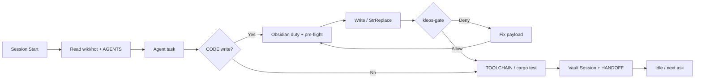

<div align="center">
  
  
  
  
</div>

<br />

<div align="center">
  <h1>kleosr</h1>
  <p><strong>Cursor harness pack — User Rules, companions, skills, and a Rust gate.</strong></p>
  <p>Master Mind V16.0.20 plus <code>kleos-gate</code>: block usual agent failure modes,<br />keep fleet repos in sync, and persist memory outside the chat.</p>
</div>

<br />

---

## Setup

```bash
git clone https://github.com/kleosr/kleosrules.git
cd kleosrules
cargo build --release --manifest-path hooks/kleos-gate/Cargo.toml
mkdir -p hooks/bin
cp -f hooks/kleos-gate/target/release/kleos-gate hooks/bin/kleos-gate
FORCE_SKILLS=1 hooks/bin/kleos-gate install
```

Paste `user-rules/USER-RULES.paste.txt` into Cursor → Settings → Rules → User Rules, start a **new** agent chat, and confirm Hooks loaded `kleos-gate`. Needs `cargo` once (or use the binary under `hooks/bin/`). Tooling is Rust-only — no Python, no pack shell.

Optional naming contract per app:

```bash
mkdir -p .cursor/rules
cp skills/vernacular/TEMPLATE.md .cursor/rules/vernacular.mdc
```

## Usage

```bash
# Install / refresh global + fleet hooks and skills
FORCE_SKILLS=1 hooks/bin/kleos-gate install

# Fleet (edit config/scan.roots first)
hooks/bin/kleos-gate sync
hooks/bin/kleos-gate verify

# House gauntlet
cd hooks/kleos-gate && cargo test && cargo build --release
hooks/bin/kleos-gate bench
hooks/bin/kleos-gate gate-diff

# Pre-flight before Write / StrReplace (pipe contents)
hooks/bin/kleos-gate --check-content --path path/to/file.rs < payload.rs
```

Loop: **paste rules → install gate → work under hooks → TOOLCHAIN green → write-back vault/HANDOFF**. Soft skills guide taste when invoked. Mechanical roofs (comments, secrets, vernacular, lean size) deny in `kleos-gate` — rewrite or stop; do not fight a deny.

Skill routes: lean → `/ponytail`; dialect → `/vernacular`; vault → `/obsidian-memory`; AST → `/codebase-memory`; product pass → `/product-completeness`.

## Files

| File | Purpose |
|------|---------|
| `user-rules/USER-RULES.paste.txt` | Master Mind paste (Settings User Rules) |
| `project-rules/*.mdc` | Always-on companions synced into `.cursor/rules` |
| `hooks/bin/kleos-gate` | Hot path + fleet CLI (regenerable; gitignored) |
| `hooks/policy/*.json` | Enforcement SSOT (no hardcoded policy in `.rs`) |
| `hooks/hooks.json` | Cursor hook registry (kleos-gate only) |
| `skills/` | On-demand Cursor skills (`config/skills.txt`) |
| `config/scan.roots` | Fleet roots for `sync` / `verify` |
| `docs/TOOLCHAIN.md` | Done recipe |
| `AGENTS.md` | Pack map |

## Workflow

```
paste User Rules → kleos-gate install → work under hooks
                     ↓
    vault hot (lab: inject; recall gate off) → edit → pre-flight → verify → write-back
```



## Architecture

```
.
├── user-rules/          — paste + Option C mirror
├── project-rules/       — always-on companions (SSOT)
├── hooks/
│   ├── bin/kleos-gate   — release binary
│   ├── kleos-gate/      — Rust crate (engine + fleet)
│   ├── policy/          — JSON roofs
│   └── hooks.json       — Cursor events
├── skills/              — personal / pack skills
├── config/              — skills list + scan roots
├── docs/                — doctrine, TOOLCHAIN, P* evals
├── AGENTS.md            — map
└── LICENSE              — MIT
```

Single pack topology — not an app monorepo. Live `.cursor/` copies are sync destinations; edit this pack and re-run `install` / `sync`.

## Development

```bash
cd hooks/kleos-gate && cargo test && cargo build --release
cp -f target/release/kleos-gate ../bin/kleos-gate
hooks/bin/kleos-gate verify
hooks/bin/kleos-gate bench
hooks/bin/kleos-gate gate-diff
```

Full checklist: [`docs/TOOLCHAIN.md`](docs/TOOLCHAIN.md). Release notes: [`docs/RELEASE.md`](docs/RELEASE.md).

## Integration

Built for Cursor Hooks + User Rules. `kleos-gate install` wires global `~/.cursor` and scanned fleet roots. Soft companions (`ponytail`, `obsidian-memory`, …) stay always-on; skills under `~/.cursor/skills` run on demand. Optional Obsidian MCP `user-obsidian` holds durable memory (COMPLETE CAPTURE — full write-backs, not stubs). Green TOOLCHAIN is a finite known-case pass, not absolute semantic proof — see [`docs/MECHANICAL-INCOMPLETENESS.md`](docs/MECHANICAL-INCOMPLETENESS.md).

## Why Rust + policy JSON?

Hooks that fail open need a fail-closed binary. Policy lives in JSON so you can change roofs without rewriting the gate. Lean meter = size roofs only ([`docs/evals/LEAN-SIZE-QUALITY-PSTAR.md`](docs/evals/LEAN-SIZE-QUALITY-PSTAR.md)). Stack map: [`docs/LAYER-STACK.md`](docs/LAYER-STACK.md) · curator: [`docs/CURSOR-CURATOR.md`](docs/CURSOR-CURATOR.md).

Built for Cursor. Sibling workflow-memory skill: [cursorkleosr](https://github.com/kleosr/cursorkleosr).

## License

MIT. See [LICENSE](LICENSE).
